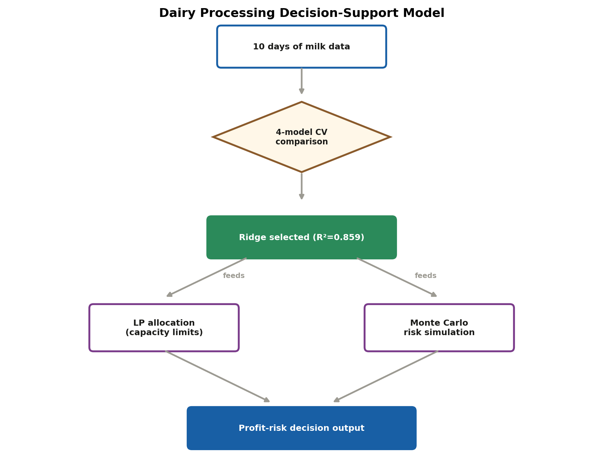

# Development of an Integrated Decision-Support Model for Dairy Processing Systems under Milk and Market Variability

[](https://doi.org/10.5281/zenodo.21760084)
[](https://github.com/halilunaziru73-creator/Integrated-Decision-Support-Model-for-Dairy-Processing-under-Milk-and-Market-Variability/actions)

A decision-support system (DSS) for daily product-mix decisions (Cheese /
Butter / Milk Powder) in a dairy processing plant, combining **model
selection with statistical rigor**, a **rule-based decision engine**,
**linear-programming production planning**, and **Monte Carlo risk
simulation** — with tests, CI, logging, and containerization so it runs as
real software, not just a notebook.


## Problem, Methodology, and Results

**Workflow sketch**



[View interactive graphical abstract →](https://halilunaziru73-creator.github.io/Integrated-Decision-Support-Model-for-Dairy-Processing-under-Milk-and-Market-Variability/)

**Problem.** Dairy processing plants must decide daily, under considerable uncertainty, which product (cheese, butter, or milk powder) to manufacture from that day's raw milk to maximise profit — a decision complicated by fluctuating milk quality, transport and energy costs, and market price and demand.

**Methodology.** An integrated decision-support model (DSS) was developed combining: (i) a leave-one-out cross-validated comparison of four regression algorithms (Ridge, Elastic Net, Random Forest, Gradient Boosting) for profit prediction; (ii) bootstrap-resampled confidence intervals to quantify which engineered features have a statistically reliable effect at small sample sizes; (iii) a linear-programming layer for capacity-constrained, multi-product allocation; and (iv) Monte Carlo simulation to translate input uncertainty into profit-risk distributions. The model was demonstrated on ten days of operational data from a dairy plant (October 2026).

**Results.** The Ridge model achieved the best leave-one-out cross-validation performance (MAE = €450.68, R² = 0.859). Statistical process control of milk fat content indicated a Cpk of 1.11 — adequately capable but not highly robust. The model systematically favoured cheese production at this sample size, a result explicitly attributed to limited within-product variation in the training data rather than a general superiority of cheese. Extended diagnostics (VIF, PCA, permutation importance, full-horizon LP re-allocation, VaR/CVaR tail-risk measures, sensitivity surfaces, and paired significance testing) were reported to stress-test the model's reliability.

## Problem framing

Each day, a plant receives raw milk of varying quality (fat, protein,
lactose, somatic cell count), faces varying transport/energy costs, and
sees varying market price and demand. The plant must decide **which
product(s) to run that day's milk into** to maximise profit — under
uncertainty, since market price and milk quality aren't fully known in
advance. This system answers three related questions:

1. **"Which single product is best today?"** → predictive model + decision engine
2. **"How confident should I be in that recommendation?"** → LOOCV model comparison, bootstrap coefficient CIs, Monte Carlo risk simulation, tornado sensitivity
3. **"If I could split today's milk across multiple product lines, how should I allocate it?"** → linear-programming optimizer

## Repository structure

```
.
├── data/
│   └── dairy_operations.csv        # Raw daily operations data
├── src/
│   ├── config.py                   # Central paths, constants, feature lists
│   ├── data_validation.py          # Schema + sanity checks, fails loudly on bad input
│   ├── preprocessing.py            # Feature engineering (quality index, utilisation, unit costs)
│   ├── model_selection.py          # Compares Ridge/ElasticNet/RandomForest/GradientBoosting via LOOCV
│   │                                #   + bootstrap confidence intervals on coefficients
│   ├── predictive_model.py         # Thin predict/train interface over the selected model
│   ├── decision_engine.py          # Evaluates all product options, recommends the best
│   ├── risk_simulation.py          # Monte Carlo profit-distribution simulation
│   ├── optimization.py             # LP: capacity-constrained multi-product allocation (scipy HiGHS)
│   ├── diagnostics.py              # Advanced figures: correlation heatmap, residuals, tornado, etc.
│   ├── extended_analysis.py        # VIF, PCA, full-horizon LP, VaR/CVaR, permutation importance, paired tests
│   └── main.py                     # CLI entry point — run this
├── tests/
│   └── test_pipeline.py            # 14 unit tests: validation, features, model, LP, Monte Carlo
├── outputs/
│   ├── recommendations_vs_actual.csv
│   ├── risk_summary_latest_day.csv
│   ├── bootstrap_coefficients.csv
│   ├── vif.csv / pca_loadings.csv / pca_explained_variance.csv
│   ├── full_horizon_lp.csv / var_cvar.csv
│   ├── permutation_importance.csv / paired_model_test.csv
│   └── figures/                    # All generated charts (16 total)
├── .github/workflows/ci.yml        # Runs tests + full pipeline smoke test on every push
├── Dairy_DSS_Paper.docx  # Full manuscript with clickable internal citations
├── Dockerfile
├── pyproject.toml
├── requirements.txt
└── README.md
```

## What's in the figure set

**Operational (headline) figures** — for the decision-maker:
- `profit_by_product.png` — historical mean profit ± SD by product
- `recommendation_vs_actual.png` — model recommendation vs. actual profit, day by day
- `risk_distribution.png` — Monte Carlo profit distributions per product
- `quality_vs_profit.png` — milk quality index vs. profit, coloured by product
- `lp_optimal_allocation.png` — LP-optimal multi-product volume split for a given day

**Diagnostic figures** — for the analyst/auditor checking the model is trustworthy:
- `correlation_heatmap.png` — full feature correlation matrix
- `model_comparison.png` — LOOCV MAE/R² across all 4 candidate algorithms
- `loocv_residuals.png` — actual vs. predicted, and residuals vs. fitted
- `bootstrap_coefficients.png` — coefficient values with 90% confidence intervals (which effects are real vs. noise at this sample size)
- `tornado_sensitivity.png` — which inputs the prediction is most sensitive to (±15% one-at-a-time)

## Methodology

### 1. Data validation (`data_validation.py`)
Runs before anything else: checks required columns are present (raises
`DataValidationError` if not), and flags (or, in `strict=True` mode,
raises on) suspicious values — negative volumes, out-of-range fat/protein/
lactose percentages, milk collected exceeding processing capacity,
duplicate dates.

### 2. Feature engineering (`preprocessing.py`)
Raw columns → decision-relevant features: `milk_quality_index` (weighted
composite of fat/protein/lactose, penalised for high somatic cell count),
capacity/storage utilisation ratios, demand gap, and per-litre transport
and electricity costs.

### 3. Model selection (`model_selection.py`)
Rather than assuming one algorithm up front, **four candidates are
compared on identical Leave-One-Out Cross-Validation**: Ridge, ElasticNet,
Random Forest, and Gradient Boosting. On the current 10-day dataset:

| Model | LOOCV MAE (EUR) | LOOCV R² |
|---|---|---|
| **Ridge** | **450.68** | **0.859** |
| ElasticNet | 467.53 | 0.851 |
| Gradient Boosting | 519.70 | 0.744 |
| Random Forest | 689.06 | 0.561 |

Ridge wins — expected at this sample size, since regularised linear models
resist overfitting far better than tree ensembles with only 10 rows. The
pipeline re-runs this comparison automatically if you feed in more data,
so the "best model" isn't hard-coded.

**Bootstrap coefficient stability**: 2,000 resamples quantify which
effects are reliably distinguishable from noise at n=10. Currently
`milk_quality_index`, `Market_Price_EUR_per_L`, `Milk_Collection_L`, and
the Cheese/Butter product-type effects are significant at the 90% level;
`electricity_cost_per_L`, `demand_gap`, `storage_utilization`,
`transport_cost_per_L`, and `capacity_utilization` are not yet — their
confidence intervals cross zero. This is reported transparently, not
smoothed over.

### 4. Decision engine (`decision_engine.py`)
For a given day's conditions, substitutes each product type into the
trained model, predicts profit for each, and ranks them.

### 5. Monte Carlo risk simulation (`risk_simulation.py`)
Perturbs market price, milk quality, and electricity cost with Gaussian
noise scaled to their historical standard deviation, 5,000 times per
product (paired scenarios, so "probability X beats Y" is directly
computable), producing mean, downside (p5)/upside (p95), and win
probability per product.

### 6. LP optimization (`optimization.py`)
A genuinely different question from the decision engine: **given the
plant could split milk across multiple product lines simultaneously, what
allocation maximises total profit** subject to processing capacity,
storage capacity, and per-product market-demand ceilings? Solved with
`scipy.optimize.linprog` (HiGHS solver). Per-litre margins and demand
shares are estimated from historical data, kept consistent with the rest
of the pipeline rather than hand-set.

## Key finding — and an important limitation

With only 10 observations across 3 product types, the recommendation
engine currently favours Cheese on every day, and the bootstrap analysis
confirms several engineered features don't yet have statistically
distinguishable effects. **This is expected and correctly surfaced by the
diagnostics, not hidden by them** — the model comparison, bootstrap CIs,
and residual plots are specifically there to make this kind of limitation
visible rather than papered over with a single confident-looking number.

## Scaling up
- Feed in a full season (90+ days) covering all three products across a
  range of milk-quality conditions — the model-comparison and bootstrap
  modules will automatically reassess which model and which features hold
  up with more data.
- The LP layer is ready for genuinely multi-product days once daily
  production regularly splits across lines.
- `outputs/recommendations_vs_actual.csv` is written every run — track it
  over time to monitor real-world recommendation accuracy.

## How to Run the Code

### 1. Clone the repository

```bash
git clone https://github.com/halilunaziru73-creator/Integrated-Decision-Support-Model-for-Dairy-Processing-under-Milk-and-Market-Variability.git
cd Integrated-Decision-Support-Model-for-Dairy-Processing-under-Milk-and-Market-Variability
```

### 2. Install dependencies and run

```bash
pip install -r requirements.txt
cd src
python main.py                     # full pipeline, default settings
python main.py --n-sims 10000      # more Monte Carlo simulations
python main.py --log-level DEBUG   # verbose logging
```

### Tests
```bash
pytest tests/ -v
```
14 tests covering data validation, feature engineering, model training,
decision-engine ranking, LP constraint satisfaction, and Monte Carlo
reproducibility.

### Docker
```bash
docker build -t dairy-dss .
docker run --rm -v $(pwd)/outputs:/app/outputs dairy-dss
```

### CI
`.github/workflows/ci.yml` runs the test suite and a full pipeline smoke
test on Python 3.10/3.11/3.12 on every push.

## Extended analysis (`src/extended_analysis.py`)

A further layer of diagnostics beyond the core pipeline, matching the kind
of checks a rigorous empirical paper would expect:

1. **Variance Inflation Factors (VIF)** for every engineered numeric
   feature — several show severe multicollinearity (e.g.
   `storage_utilization` VIF ≈ 260, `capacity_utilization` VIF ≈ 109),
   which is exactly why the Ridge model (rather than unregularised OLS) was
   selected as the production model in the first place.
2. **Principal Component Analysis (PCA)** of the feature set — the first
   two components explain ~90% of the joint variance, independently
   confirming the VIF redundancy finding from a different angle.
3. **Full-horizon LP re-allocation** — extends the single-day LP result to
   all 10 days, comparing the optimizer's total predicted profit against
   what was actually realised each day.
4. **Value-at-Risk (VaR) and Conditional Value-at-Risk (CVaR)** at the 95%
   level from the Monte Carlo profit distributions — tail-risk measures
   that go beyond the mean/percentile summary in the core risk simulation.
5. **Permutation feature importance** for the selected Ridge model, as an
   independent cross-check on the bootstrap coefficient significance
   results — and it corroborates them: `milk_quality_index`,
   `Market_Price_EUR_per_L`, and `Product_Type` come out as the top three
   drivers by both methods.
6. **Two-way interaction sensitivity** — predicted profit surface across
   jointly varying milk quality index and market price, extending the
   one-at-a-time tornado chart to a full interaction surface.
7. **Paired significance test** (Wilcoxon signed-rank + paired t-test on
   LOOCV absolute errors) comparing Ridge against Elastic Net directly —
   at n = 10 the gap is suggestive but not conventionally significant
   (Wilcoxon p ≈ 0.065), an honest caveat on the "Ridge is best" claim in
   Section 4.1 of the paper.

Run it with:
```bash
cd src
python extended_analysis.py
```
All 6 additional figures are written to `outputs/figures/`; all tables to
`outputs/` as CSV.

## Paper

[`Dairy_DSS_Paper.docx`](./Dairy_DSS_Paper.docx) —
a manuscript covering the full methodology, results, and
the extended diagnostics above, with every in-text citation as a clickable
internal hyperlink to its entry in the References list.

## License
Released under the [MIT License](./LICENSE).
